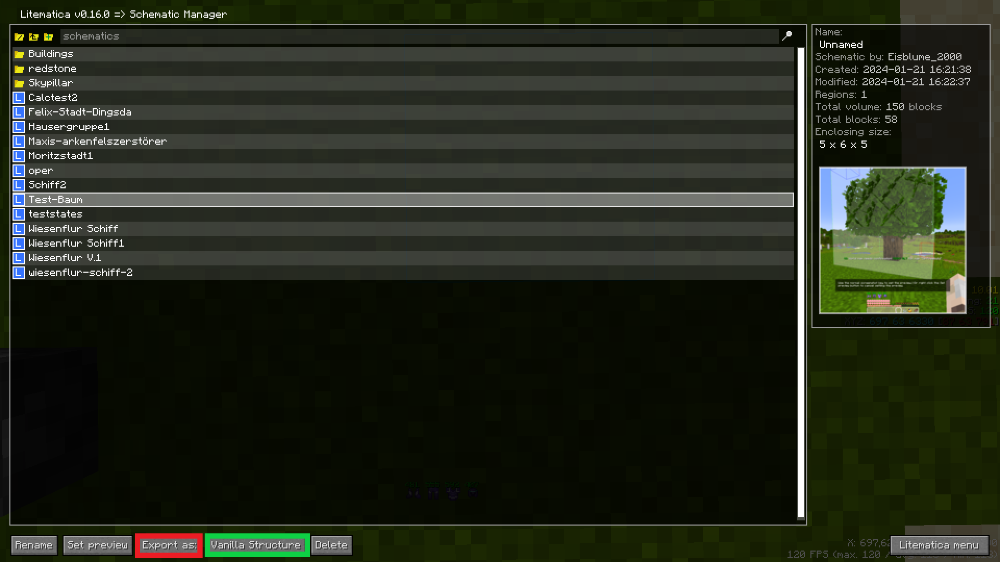
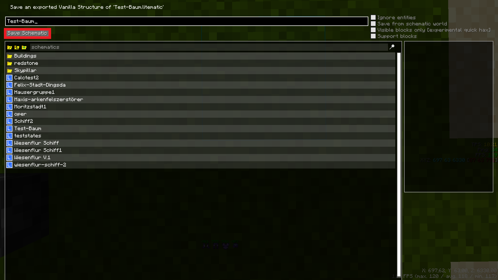

# CESPC
Schematic Preis Rechner
Berechnet Automatisch den Wert aller Materialien einer Schematic

##Erklärung
* Programm ausführen
* Schematic auswählen
* Auf "Kalkulation starten" drücken
* Warten
* Ergebniss bewundern

## Funktionen
* Preis berechnen
* Angabe der Menge an Blöcken die man nicht kaufen kann
* Ignorier Liste
* Aktuell werden nur .nbt datein Unterstützt

## Eine Schematic in eine .nbt Datei umwandeln
* Öffne dein Litematic Menu und drücke auf Schematic Manager
 
* WÄhle die gewünschte Schematic aus und setze den Grün Markierten Knopf auf "Vanilla Structure", drücke danach auf "Export as" (Rot markiert)
 
* Drücke nun auf "Save Schematic", die Datei sollte nun als .nbt gespeichert worden sein
  
