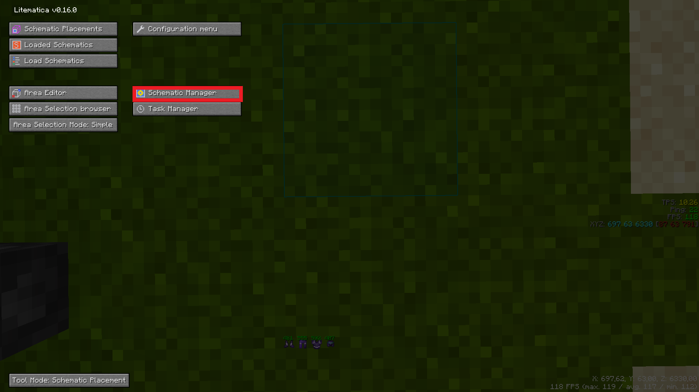

# CESPC
Schematic Preis Rechner

Creative-Empire Edition

Berechnet Automatisch den Wert aller Materialien einer Schematic

Von Eisblume2000 geschrieben (DC: eisblume2000 / Eisblume2000#5142)

## Erklärung
 Programm ausführen
 
 Schematic auswählen
 
 Auf "Kalkulation starten" drücken
 
 Warten
 
 Ergebniss bewundern

## Funktionen
* Preis berechnen
* Angabe der Menge an Blöcken die man nicht kaufen kann
* Ignorier Liste
* Aktuell werden nur .nbt datein Unterstützt

## Eine Schematic in eine .nbt Datei umwandeln
* Öffne dein Litematic Menu und drücke auf Schematic Manager
 
* WÄhle die gewünschte Schematic aus und setze den Grün Markierten Knopf auf "Vanilla Structure", drücke danach auf "Export as" (Rot markiert)
 
* Drücke nun auf "Save Schematic", die Datei sollte nun als .nbt gespeichert worden sein
  

## Bug gefunden?
* Erstelle einfach einen Report [hier](https://github.com/Eisblume-2000/CESPC/issues), oder wenns gar nicht anders geht schreib mir auf Discord.

  Bitte erkläre wie ich den Bug reproduzieren kann, am besten sendest du das debuglog gleich mit

## Wichtig zu Wissen
* Das Server Team hat mit diesem Programm hier nichts zu tun und kann deshalb kein Support geben, jeder der von mir erwischt wird wie er das Team belästigt wird von mir blockiert und erst recht keine Antwort erhalten
* Diese Programm ist nicht Anfängerfreundlich, jeder der nicht weiß wie er sein Schematics in seinen Datein finden kann sollte dies tun bevor her mich belästigt.

## TODO
* Schreiben lernen und Rechtschreibfehler beheben
* Auto Bugreport System
* Schematic Subtraktionsmodul

## Special Thanks to:
* [Iunius118](https://gist.github.com/Iunius118/989807ba3b6c5b3dfcb3750547951803) dafür das er den Wunderbaren Code erstellt hat um .nbt Datein auszulesen
* Byspielhaft dafür das er mir geholfen hat

  
